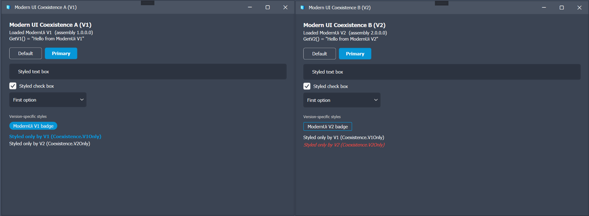

# ExtrabbitCode.Inventor.ModernUi

[](https://www.nuget.org/packages/ExtrabbitCode.Inventor.ModernUi)
[](https://www.nuget.org/packages/ExtrabbitCode.Inventor.ModernUi)


A small WPF styling library that gives Inventor add-in dialogs a consistent, Inventor-aligned look
(light + dark) **without** the process-global WPF state that makes UI libraries collide between
add-ins. It is **styles on standard WPF controls** — not a control framework.

The bar it clears: **two different versions of this library can be loaded into one `Inventor.exe`
(multiple add-ins) and used at once with zero conflicts** — worst case is cosmetic, never an
exception. This is verified by an automated two-`AssemblyLoadContext` test.

## Projects

| Project | Type | What it's for |
|---|---|---|
| `ExtrabbitCode.Inventor.ModernUi` | Class library (the deliverable) | The styling library. Public API (`Theme`, `ThemePalette`, `FontOptions`, `ModernWindow`, `ModernUi.Apply`/`SetTheme`) plus the control styles (`Controls/*.xaml`), design tokens (`Shared.xaml`) and the WindowChrome title bar. The only thing a real add-in references. |
| `ExtrabbitCode.Inventor.ModernUi.Gallery` | WPF desktop app (.exe) | Runs **without Inventor** for fast visual iteration: opens the paged control gallery in light/dark; `--shoot <dir>` renders it to PNG. Also the home of `GalleryView` — the showcase UserControl with every styled control. |
| `ExtrabbitCode.Inventor.ModernUi.Demo.AddIn` | Inventor 2025+ add-in (COM class library) | The in-Inventor demo. Reads the active Inventor theme + UI font and shows the gallery in a themed dialog. Embeds a native manifest for registration-free COM and auto-deploys on build. Links `GalleryView` from the Gallery project (no duplication). |
| `ExtrabbitCode.Inventor.ModernUi.ConflictTest` | Console app | Headless acceptance test (the fast CI check): builds **two different versions** of the library (V1 + V2, each with a version-only method), loads each into its own isolated `AddinLoadContext`, and in each calls its version-only method **and** themes a window. Prints `RESULT: PASS`. |
| `ExtrabbitCode.Inventor.ModernUi.Coexistence.A` / `.B` | Inventor 2025+ add-ins (COM class libraries) | The in-Inventor coexistence proof: two *separate* add-ins, **A ships ModernUi V1, B ships V2**, each loading its own copy in an isolated `AddinLoadContext` (`IsolatedApplicationAddInServer`). Each opens a themed dialog showing which version it loaded and the result of its version-only method. Load both in one Inventor session to confirm zero conflicts live. |

Dependency flow: everything references the **library**; the **add-in** and **Gallery** share `GalleryView`; the **ConflictTest** loads the library by reflection (to get two isolated copies). The library, Gallery and ConflictTest build and run anywhere; the **Demo.AddIn** and **Coexistence.A/B** need Inventor installed to load.

## Starter template

Building an Inventor add-in from scratch? [**ExtrabbitCode.Inventor.Core.Template**](https://github.com/TWiesendanger/ExtrabbitCode.Inventor.Core.Template)
is a ready-to-use add-in starter — isolated `AssemblyLoadContext`, ribbon/command scaffolding and the
deploy plumbing already wired up — and it uses ModernUi as its **default UI**.

## Using it in an add-in

```csharp
// Read the theme + font from Inventor, then apply window-scoped.
Theme theme = app.ThemeManager.ActiveTheme.Name == "LightTheme" ? Theme.Light : Theme.Dark;
FontOptions font = FontOptions.FromInventor(app.GeneralOptions.TextAppearance, app.GeneralOptions.TextSize);

var dialog = new ModernWindow(theme, font: font) { Title = "My dialog", Content = myView };
new WindowInteropHelper(dialog) { Owner = new IntPtr(app.MainFrameHWND) };
dialog.Show();
```

Standard controls inside the window are themed automatically — see **Controls & components** below.

## Controls & components

The **Gallery** app is the live reference — every item below has a page there with copyable XAML.

**Themed automatically** (just use the standard control inside a `ModernWindow`, or a window passed
to `ModernUi.Apply`):
`Button`, `TextBox`, `CheckBox` (incl. tri-state / indeterminate), `RadioButton`, `ComboBox`,
`ListBox`, `TreeView`, `TabControl`, `DataGrid`, `Slider` (ticks + snapping), `ProgressBar`,
`Menu` / `ContextMenu`, `ScrollBar`, `ToolTip`, `GroupBox`, `Separator`, `TextBlock`, `Label` — plus
the `ModernWindow` title bar.

**Opt-in keyed styles** — `Style="{DynamicResource <Name>}"`:

| Purpose | Keys |
|---|---|
| Buttons | `AccentButton`, `IconButton` |
| Typography | `TitleTextStyle`, `BodyTextStyle`, `CaptionTextStyle` |
| Surface / toggle | `Card`, `ToggleSwitch` |
| Badges | `Badge`, `BadgeAccent`, `BadgeError`, `CounterBadge`, `ShieldLabel` + `ShieldValue` |
| Loaders | `Spinner`, `DotsLoader`, `IndeterminateBar` |

**Dialogs & notifications** — code helpers, no XAML needed:

```csharp
ModernDialogResult r = ModernMessageBox.Show(owner, theme, "Delete the selected items?",
    "Confirm", ModernDialogButtons.YesNo, ModernDialogIcon.Question);

ModernToast.Show(owner, "Export completed.", ToastType.Success, title: "Done");
ModernToast.MaxVisible = 3;                             // cap shown at once
ModernToast.DefaultDuration = TimeSpan.FromSeconds(4);  // auto-dismiss (per-call duration overrides)
```

Both are hosted window-scoped (the toast inside the owner's visual tree) and **inherit the owner
window's palette**, so a customized accent carries through. Loader animation speed is fixed in the
styles; drive a controllable `AnimationClock` if you need it adjustable at runtime (see the Gallery's
speed-control samples).

## Changing colors

Colors live in one place — the `ThemePalette` record (`ThemePalette.cs`). To re-skin without
forking, override at apply-time:

```csharp
ModernUi.Apply(window, Theme.Dark,
    ThemePalette.Dark with { Accent = (Color)ColorConverter.ConvertFromString("#FF8A00") });
```

`ModernUi.SetTheme(window, theme, palette)` re-colors a window **live** (the Gallery's accent dropdown
uses this). Alongside each `Brush.*`, the apply step also injects a raw `Color.*` resource (e.g.
`Color.Accent`) for the few places that need a `Color` rather than a brush — gradient stops and
animations such as the indeterminate progress bar.

Non-color tokens (corner radius, control height, paddings) live in `Shared.xaml`.

## Design rules (why it is conflict-free)

- No custom dependency properties registered against framework types.
- No custom controls except `ModernWindow : Window` (own type, never cast across copies; no
  framework-type DPs; never referenced from XAML).
- Window-scoped resources only — **never** `Application.Current.Resources`.
- Colors/font built in code and injected per window; style XAML references only framework types and
  string resource keys via `DynamicResource`.
- Style dictionaries load via a **version-qualified pack URI** (`;v1.2.3.4;component`), so when two
  builds share the same simple name in one process each window resolves *its own* version's XAML
  (falls back to the simple-name URI if a host can't resolve it — cosmetic at worst).

These rules are enforced at **build time**: a Roslyn-backed MSBuild task (`EnforceCoexistenceRules`
in the library `.csproj`) fails the build if any source calls `DependencyProperty.Register*`, touches
`Application.Current.Resources`, subclasses a WPF control (other than `ModernWindow`), or references
this assembly from a XAML `clr-namespace`. The design rules can't silently rot as the library grows.

## Proving coexistence — and why it matters

The library exists because **multiple Inventor add-ins run in one `Inventor.exe`**, and each may ship
its *own* copy/version of a UI library. WPF keeps process-global state — the `DependencyProperty`
registry, `Application.Current.Resources`, and the XAML `xmlns→assembly` cache — in framework
assemblies shared across every `AssemblyLoadContext`. A library that registers DPs against framework
types, writes to `Application.Resources`, or relies on the global xmlns cache will, when two versions
load, crash with one of three failures: `DependencyProperty already registered`, an
`Application.Resources` value clash, or a cross-version `InvalidCastException` (version B's XAML
building version A's controls). This library is built to make all three impossible.

Two layers prove it:

1. **`ConflictTest` (headless, runs in CI).** Builds the library as V1 and V2, loads each in its own
   `AddinLoadContext`, calls a method that exists *only* in that version, and themes a window. Fast,
   deterministic, no Inventor required.

2. **`Coexistence.A` + `Coexistence.B` (the ultimate, in-Inventor test).** Two real add-ins, each
   isolated, **A on ModernUi V1 and B on V2**, loaded into one running Inventor. Why this is the
   strongest possible test:
   - **Different versions, not two copies of one.** The worst real-world crash is *cross-version*
     (the `InvalidCastException` above); two copies of the same version can't surface it. This is the
     realistic case — e.g. one add-in on 1.2, another on 1.5.
   - **Isolation is required, so it's exercised.** The runtime won't load two same-named assemblies
     with different versions into one context, so each add-in *must* isolate its copy. That makes the
     `IsolatedApplicationAddInServer` / `AddinLoadContext` path part of the test.
   - **A version-only method proves no unification.** A calls `GetV1()`, B calls `GetV2()`; each
     lacks the other's method. If both succeed, two genuinely distinct assemblies are running — not
     silently merged into one.
   - **Both dialogs render = no global clash.** Both themed windows opening together, with no
     exception, is the live confirmation that the three failure modes don't happen.
   - **Version-specific styles, visibly resolved per version.** Each build ships a *different*
     `Controls/VersionShowcase.xaml` at the same logical path. The dialog shows a "version badge"
     styled differently in V1 (filled pill) vs V2 (outlined chip) — proving the version-qualified
     pack URI resolves the correct one — plus two labels styled by a `V1Only` / `V2Only` key that
     exists in only one build: the absent one simply stays unstyled. That is the **"a control one
     version doesn't know about"** case, degrading gracefully instead of throwing.

   To run it: build the two add-ins (deploys each with its own library version + `.addin`), start
   Inventor 2025+, and open both add-ins' **Modern UI Coexistence** buttons. Two themed dialogs, one
   reading "ModernUi V1 … GetV1()", the other "ModernUi V2 … GetV2()", with no errors = pass.



*Both add-ins live in a single `Inventor.exe`. A loaded ModernUi **1.0.0.0** and called `GetV1()`; B
loaded **2.0.0.0** and called `GetV2()` — each version-only method exists only in its own build. The
version-specific styles resolve per version (V1's filled badge vs V2's outlined chip), and a key
present in only one build (`Coexistence.V1Only` / `V2Only`) simply stays unstyled in the other. Both
dialogs render together with no exception — worst case cosmetic, never a crash.*

## Build & verify

```
dotnet build
dotnet run --project ExtrabbitCode.Inventor.ModernUi.ConflictTest   # expect RESULT: PASS
dotnet run --project ExtrabbitCode.Inventor.ModernUi.Gallery         # interactive preview
```

`-p:DeployToInventor=false` skips the add-in deploy steps (CI/library-only builds);
`-p:BuildCoexistenceVersions=false` skips building the two test versions.

See the add-in's own `README.md` for installing it into Inventor.

## NuGet package

Only the **library** (`ExtrabbitCode.Inventor.ModernUi`) is packaged; the gallery and add-ins are not.

### Publishing (CI)

`.github/workflows/main.yml` runs when a **GitHub Release is published** and uses NuGet
**trusted publishing** (OIDC — no stored API key). It:

1. runs on `windows-latest` — WPF / `net8.0-windows` cannot build on Linux;
2. derives the package version from the release tag (`v1.2.3` → `1.2.3`);
3. packs the library and pushes to nuget.org with `--skip-duplicate`.

To cut a release, create a GitHub Release tagged `vMAJOR.MINOR.PATCH`. The **tag** drives the package
version (via `-p:PackageVersion`); the csproj `<Version>` is only the local default, so the two are
independent. (Requires the package's trusted-publishing policy configured on nuget.org and the
`NUGET_USERNAME` repository secret.)

### Build / pack locally

```
# build just the library (Release)
dotnet build ExtrabbitCode.Inventor.ModernUi/ExtrabbitCode.Inventor.ModernUi.csproj -c Release

# produce the .nupkg (+ .snupkg) with a chosen version
dotnet pack ExtrabbitCode.Inventor.ModernUi/ExtrabbitCode.Inventor.ModernUi.csproj -c Release \
    -p:PackageVersion=1.2.3-local -o ./artifacts
```

Inspect the result with `unzip -l ./artifacts/*.nupkg`: README + icon at the root, and
`lib/net8.0-windows7.0/` with the DLL and XML docs — no demo/add-in files.

### Test the package before publishing

Register the local `artifacts` folder as a NuGet source and reference it from a throwaway project:

```
dotnet nuget add source <abs-path>\artifacts -n modernui-local
dotnet add <your-project> package ExtrabbitCode.Inventor.ModernUi --version 1.2.3-local --source modernui-local
```

Use a `-local` (prerelease) suffix so it never collides with a real published version. Remove the
source again with `dotnet nuget remove source modernui-local`.

## Installer (setup.exe)

A Windows installer (built with [Inno Setup](https://jrsoftware.org/isinfo.php)) is attached to each
GitHub Release. It has two selectable components:

- **Modern UI Gallery** — the standalone WPF app, published **self-contained** (no .NET runtime
  prerequisite), into Program Files with Start-menu (and optional desktop) shortcuts.
- **Inventor add-in** — deploys the add-in to `%ProgramData%\ExtrabbitCode\…\Demo.AddIn` and the
  `.addin` manifest to `%ProgramData%\Autodesk\Inventor Addins`, so the gallery opens from the
  Inventor ribbon (Inventor 2025+). Uninstalling removes both.

### Build the installer locally

Requires the .NET 8 SDK and Inno Setup 6.

```
pwsh installer\build.ps1 -Version 1.2.3
```

This publishes the self-contained app, builds the add-in payload, and compiles
`installer\ModernUi.iss` → `installer\Output\ExtrabbitCode.Inventor.ModernUi-Setup-<version>.exe`.

Branding (the setup/app icon `resources\ModernUi.ico` and the wizard images `installer\wizard-*.bmp`)
is committed; it only needs regenerating from the PNG logos if the branding changes.

### Publishing (CI)

The `installer` job in `.github/workflows/main.yml` runs on a published Release (Windows runner):
it installs Inno Setup, runs the same `build.ps1` with the tag version, and uploads the resulting
`setup.exe` to the release assets. So a single `vX.Y.Z` release produces **both** the NuGet package
and the installer.
